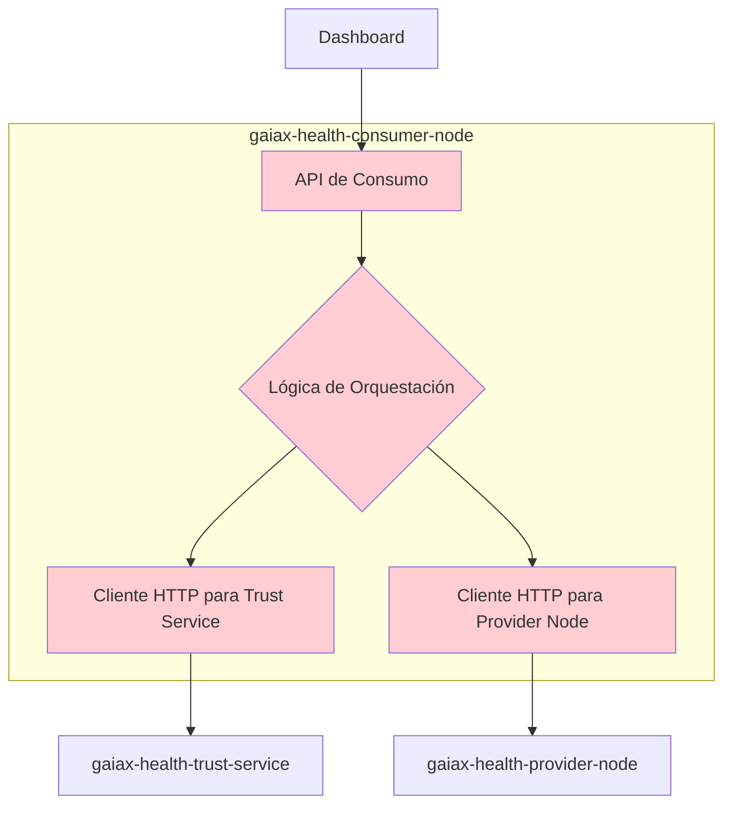
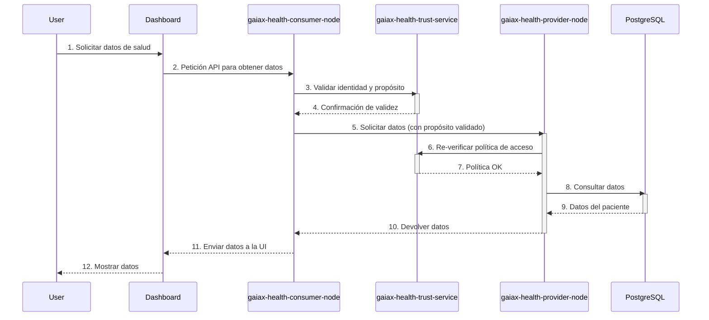
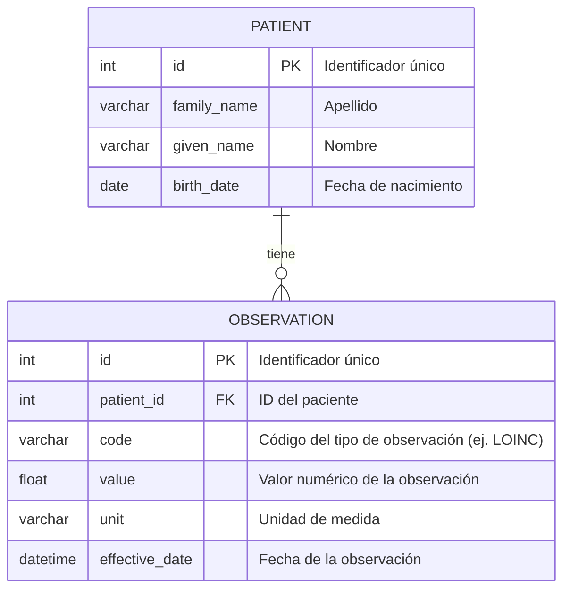
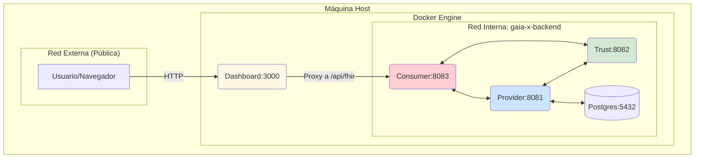

# Capítulo: Diseño, Arquitectura y Despliegue del Prototipo

Este capítulo detalla el diseño técnico y la arquitectura del prototipo de espacio de datos para el sector salud, desarrollado como parte de este Trabajo Fin de Grado. Se presenta la descomposición del sistema en microservicios, los flujos de datos federados, el modelo de persistencia y la estrategia de despliegue y evaluación de rendimiento, todo ello alineado con los principios de Gaia-X.

## 1. Visión General de la Arquitectura

El sistema se ha diseñado siguiendo una arquitectura de microservicios distribuida. El objetivo es desacoplar las responsabilidades, mejorar la escalabilidad individual de los componentes y simular un ecosistema de datos federado donde distintos participantes (nodos) interactúan de forma segura y soberana.

La comunicación entre servicios se realiza principalmente a través de APIs REST, y el despliegue se gestiona mediante contenedores Docker, orquestados con Docker Compose para facilitar la reproducibilidad del entorno. Cada microservicio representa un rol o una capacidad específica dentro del espacio de datos, como se detalla a continuación.

## 2. Arquitectura de Microservicios

El prototipo está compuesto por cuatro servicios principales y una base de datos, cada uno con un propósito bien definido dentro del ecosistema Gaia-X.

### 2.1. Servicio Proveedor (`gaiax-health-provider-node`)

El nodo proveedor es el custodio de los datos. Su responsabilidad principal es gestionar el acceso a los recursos de datos (en este caso, datos de salud en formato FHIR), aplicando las políticas de uso y consentimiento definidas.

**Responsabilidades clave:**
- Exponer un endpoint de datos compatible con FHIR.
- Validar las peticiones de acceso contra el servicio de confianza.
- Gestionar la conexión con la base de datos PostgreSQL donde residen los datos.
- Registrar (log) todas las transacciones de datos para auditoría.

#### Diagrama de Arquitectura Interna

```mermaid
%% Objetivo: Mostrar los componentes internos del servicio Proveedor.
graph TD
    subgraph gaiax-health-provider-node
        direction LR
        A[API Gateway / Controller] --> B{Lógica de Negocio};
        B --> C[Acceso a Datos (JPA/JDBC)];
        C --> D[(PostgreSQL DB)];
        B --> E[Cliente HTTP para Trust Service];
    end

    E --> F[gaiax-health-trust-service];

    style A fill:#cde4ff
    style B fill:#cde4ff
    style C fill:#cde4ff
```

### 2.2. Servicio de Confianza (`gaiax-health-trust-service`)

Este servicio actúa como el ancla de confianza del ecosistema. Centraliza la lógica de gobernanza, como la gestión de identidades de los participantes, la validación de políticas y la gestión de consentimientos. Es un componente crítico para establecer un marco de confianza (Trust Framework).

**Responsabilidades clave:**
- Gestionar un registro de participantes autorizados en el espacio de datos (ej. sus DIDs).
- Validar las políticas de consentimiento asociadas a una transacción de datos.
- Ofrecer una API para que otros servicios puedan verificar la confianza y las políticas.

#### Diagrama de Arquitectura Interna

```mermaid
%% Objetivo: Describir la arquitectura del servicio de Confianza.
graph TD
    subgraph gaiax-health-trust-service
        direction LR
        A[API de Gobernanza] --> B{Lógica de Políticas y Confianza};
        B --> C[Registro de Participantes];
        B --> D[Motor de Políticas (Consentimiento)];
    end

    style A fill:#d5e8d4
    style B fill:#d5e8d4
    style C fill:#d5e8d4
    style D fill:#d5e8d4
```

### 2.3. Servicio Consumidor (`gaiax-health-consumer-node`)

Representa a la entidad que necesita acceder a los datos para un propósito específico (ej. investigación). Su función es orquestar la petición de datos, interactuando primero con el servicio de confianza y luego con el proveedor.

**Responsabilidades clave:**
- Exponer una API para que las aplicaciones finales (como el Dashboard) soliciten datos.
- Comunicarse con el Servicio de Confianza para autenticarse y obtener las credenciales o validaciones necesarias.
- Realizar la petición final al Nodo Proveedor, presentando la justificación del propósito de uso.

#### Diagrama de Arquitectura Interna



### 2.4. Dashboard (`gaiax-health-dashboard`)

Es la interfaz de usuario final, una aplicación web (Vue.js) que permite visualizar los datos de salud obtenidos a través del ecosistema. Actúa como el cliente principal del Nodo Consumidor.

**Responsabilidades clave:**
- Ofrecer una interfaz gráfica para que un usuario inicie una petición de datos.
- Visualizar los datos de salud recibidos en un formato legible.
- Actúa como proxy inverso (Nginx) para enrutar las peticiones a los servicios de backend, simplificando la configuración en el navegador y evitando problemas de CORS.

## 3. Flujo de Datos Federado

El flujo de datos principal simula una petición de datos de salud para investigación. Involucra a todos los nodos y sigue un patrón que garantiza la soberanía y la confianza.

El proceso es el siguiente:
1.  El **Usuario**, a través del **Dashboard**, solicita acceso a datos de pacientes.
2.  El **Dashboard** reenvía la petición a su backend, el **Nodo Consumidor**.
3.  El **Nodo Consumidor** inicia el proceso. Primero, contacta al **Servicio de Confianza** para validar su identidad y el propósito de la petición (ej. "investigación").
4.  El **Servicio de Confianza** verifica que el Consumidor es un participante legítimo y que el propósito está permitido por la política de gobernanza. Devuelve una confirmación.
5.  Con la validación, el **Nodo Consumidor** realiza la petición de datos al **Nodo Proveedor**, incluyendo la información de su identidad y el propósito validado.
6.  El **Nodo Proveedor** recibe la petición. Antes de acceder a los datos, realiza su propia verificación contra el **Servicio de Confianza** para asegurarse de que la petición es legítima y cumple con las políticas de consentimiento del dato.
7.  Una vez validado, el **Nodo Proveedor** accede a la base de datos **PostgreSQL**, recupera los datos y los devuelve al **Nodo Consumidor**.
8.  El **Nodo Consumidor** recibe los datos y los pasa al **Dashboard**, que los presenta al usuario.

#### Diagrama de Secuencia del Flujo de Datos



## 4. Diseño del Modelo de Datos

La persistencia de los datos de salud se gestiona mediante una base de datos relacional PostgreSQL. La elección de PostgreSQL se debe a su robustez, extensibilidad, amplio soporte en el ecosistema Java y sus capacidades para manejar datos semi-estructurados con JSONB, lo cual es ideal para recursos FHIR.

El esquema de la base de datos está diseñado para almacenar recursos FHIR. Para este prototipo, se ha simplificado a unas pocas tablas que representan la información clave de Pacientes y Observaciones.

#### Diagrama Entidad-Relación (ERD)



## 5. Arquitectura de Despliegue y Nodos

El sistema completo se despliega como una red de contenedores Docker interconectados, definidos y orquestados a través de un único fichero `docker-compose.yml`. Esta aproximación garantiza un entorno de desarrollo y pruebas consistente y fácilmente reproducible.

La arquitectura de red utiliza una red interna (`gaia-x-backend`) para la comunicación entre los microservicios, asegurando que solo los servicios que necesitan exposición pública (como el Dashboard) sean accesibles desde el exterior. Esta segmentación es una práctica de seguridad fundamental (defense in depth).

#### Diagrama de Despliegue



## 6. Análisis de Escalabilidad y Pruebas de Carga

Una de las ventajas de la arquitectura de microservicios es la capacidad de escalar componentes de forma independiente.

### 6.1. Estrategia de Escalabilidad

La escalabilidad del sistema se puede abordar horizontalmente. Por ejemplo, si el **Nodo Proveedor** se convierte en un cuello de botella debido a un alto número de peticiones de datos, es posible desplegar múltiples instancias de este servicio detrás de un balanceador de carga. Con Docker Compose, esto se puede simular con:

```bash
docker-compose up --scale provider=3
```

De manera similar, si el **Servicio de Confianza** recibe muchas peticiones de validación, también puede ser escalado. La base de datos PostgreSQL puede escalarse mediante técnicas como la replicación (lectura) o el sharding (escritura), aunque esto excede el alcance del prototipo actual. La migración a un orquestador como Kubernetes permitiría gestionar este escalado de forma automática basado en métricas de uso (Horizontal Pod Autoscaler).

### 6.2. Resultados de Pruebas de Carga

**NOTA:** Los datos presentados en esta sección son **ejemplos ilustrativos**. Debes reemplazarlos con los resultados obtenidos de tus propias pruebas.

Para evaluar el rendimiento del prototipo, se diseñaron y ejecutaron pruebas de carga utilizando la herramienta **k6 (Grafana Labs)**. Se simularon múltiples usuarios virtuales (VUs) realizando la operación de consulta de datos completa.

Los escenarios de prueba se centraron en medir el tiempo de respuesta de extremo a extremo (latencia), el número de peticiones por segundo (throughput) y el consumo de recursos (CPU, memoria) de cada microservicio bajo diferentes niveles de concurrencia.

A continuación, se presenta una tabla con los resultados para un escenario de 50 usuarios virtuales durante 1 minuto.

| **Métrica**              | **Consumer** | **Provider** | **Trust** | **E2E** |
| ------------------------ | ------------ | ------------ | --------- | ------- |
| Peticiones/seg (RPS)     | 45.8         | 45.8         | 91.6      | 45.8    |
| Latencia media (ms)      | 25.3         | 40.1         | 12.5      | 85.1    |
| Latencia p95 (ms)        | 42.1         | 65.7         | 20.3      | 135.2   |
| Tasa de errores (%)      | 0            | 0            | 0         | 0       |
| Uso CPU promedio (%)     | 35%          | 55%          | 20%       | -       |

**Tabla 1: Resultados de la prueba de carga con 50 VUs (Datos de ejemplo).**

#### Análisis de Resultados (Ejemplo)

Los datos de la Tabla 1 muestran que el **Nodo Proveedor** es el componente con la mayor latencia y consumo de CPU. Esto es esperable, ya que orquesta la validación de políticas y el acceso a la base de datos. El **Servicio de Confianza** es extremadamente rápido, ya que su lógica es simple. Se observa que el sistema es capaz de manejar ~46 peticiones por segundo sin errores, pero la latencia en el percentil 95 (135.2 ms) indica que bajo carga, el 5% de los usuarios experimentan respuestas más lentas. Esto sugiere que el primer candidato para la optimización o el escalado horizontal sería el **Nodo Proveedor**.

#### Gráfica de Rendimiento (Ejemplo)

A continuación se muestra una gráfica conceptual que relaciona la latencia con el aumento de usuarios virtuales. Deberías generar una similar con tus datos.


**Figura X: Gráfica de latencia (p95) en función del número de usuarios virtuales (Imagen de ejemplo).**

Esta gráfica mostraría visualmente cómo se degrada el rendimiento del sistema a medida que aumenta la carga, permitiendo identificar el punto en el que el sistema se satura.

---

## 7. Bibliografía y Referencias

A continuación se listan las principales tecnologías, estándares y herramientas utilizadas en el desarrollo de este proyecto.

- **Gaia-X Association:** Documentación oficial y especificaciones de la arquitectura. *[https://gaia-x.eu/](https://gaia-x.eu/)*
- **Spring Boot:** Framework para la creación de los microservicios en Java. *[https://spring.io/projects/spring-boot](https://spring.io/projects/spring-boot)*
- **Vue.js:** Framework progresivo de JavaScript para la construcción de la interfaz de usuario (Dashboard). *[https://vuejs.org/](https://vuejs.org/)*
- **Docker & Docker Compose:** Plataforma de contenedores para el empaquetado y despliegue de la aplicación. *[https://www.docker.com/](https://www.docker.com/)*
- **PostgreSQL:** Sistema de gestión de bases de datos relacional utilizado para la persistencia de los datos. *[https://www.postgresql.org/](https://www.postgresql.org/)*
- **HL7 FHIR:** Estándar para el intercambio de información médica electrónica. *[https://www.hl7.org/fhir/](https://www.hl7.org/fhir/)*
- **k6 (Grafana Labs):** Herramienta de código abierto para pruebas de carga y rendimiento. *[https://k6.io/](https://k6.io/)*
- **Mermaid.js:** Lenguaje basado en texto para la generación de diagramas y flujogramas. *[https://mermaid.js.org/](https://mermaid.js.org/)*
- **Mermaid Live Editor:** Editor online utilizado para la creación y exportación de los diagramas de este documento. *[https://www.mermaidonline.live/editor](https://www.mermaidonline.live/editor)*
- **NGINX:** Servidor web de alto rendimiento utilizado como proxy inverso en el servicio de Dashboard. *[https://www.nginx.com/](https://www.nginx.com/)*
